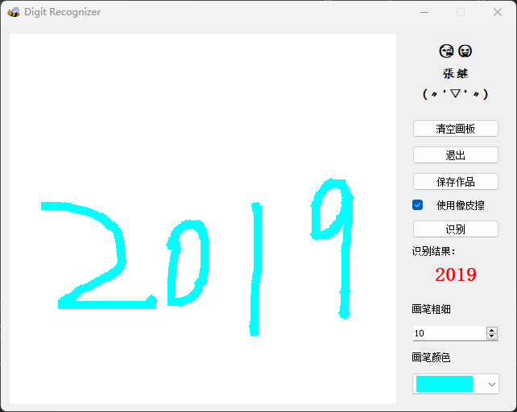

# digit-recognizer

## 这是什么

这是一个Python实现的简易（玩具）的手写数字识别器，你可以通过鼠标或触摸板书写数字然后点击识别按钮进行识别，效果如下：


## 如何运行
### 安装python
此项目使用python3.6.3版本，请做参考，更高或更低版本可能不适用本项目（无法安装依赖或程序异常退出）。
### 安装项目依赖
进入项目根目录执行：
```bash
pip install -r requirement.txt
```
### 运行项目
```bash
python ./main.py
```
